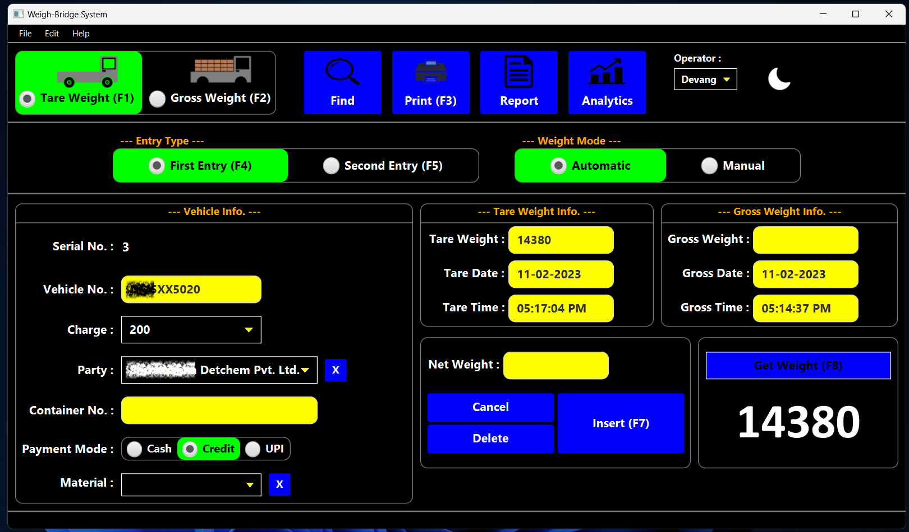

# Weigh-Bridge-System
Weigh-Bridge System is a single-user JavaFX application for managing vehicle weight records along with other features
such as:

* Receiving and capturing weight data from YH-T3 (Signal: RS232C) Weighing Indicator through a serial port.
* Changing serial port settings (Port, Baud rate, Data bits, Stop bits, Parity).
* Inserting, updating and deleting a vehicle weight record.
* Finding and viewing vehicle weight records.
* Printing vehicle weight receipt.
* Printing a report and exporting with PDF or XLSX format.
* Analytics - visualizing vehicle weight records data on chart.
* Switching between light and dark theme.



## Implementation
The application uses a Microsoft Access Database file(.accdb) to store vehicle weight records and other system related
data.

[UCanAccess](https://ucanaccess.sourceforge.net/site.html) is used for connecting to database and executing queries.

Serial port communication is implemented with [JSerialComm](https://fazecast.github.io/jSerialComm/).

[Apache PDFBox](https://pdfbox.apache.org/) is used to generate receipt and report document. For exporting report with
XLSX format, [Apache POI](https://poi.apache.org/) is used.

To prevent the user from running multiple instances of the application simultaneously,
[JUnique](http://www.sauronsoftware.it/projects/junique/) is used.

## Setup
### Database
1) Specify the path of settings.txt file in login.LoginController
2) Specify the path of database file (WBS_DB.accdb) in settings.txt
3) Specify the username and password for launching the main application in 'User' table in WBS_DB.accdb

The default password for WBS_DB.accdb is "admin". If you change the password for WBS_DB.accdb, make sure you specify it
in database.Connection Class too.

### Serial Port Communication
The default settings for serial port is as follows:
* Baud rate - 2400
* Data bits - 8
* Stop bits - 1
* Parity - 0

The application is intended to receive and capture weight data (Integer) from YH-T3 (Signal: RS232C) Weighing Indicator
device.

You can customize the serialEvent() method in serial.communication.SerialPortConnection Class to receive and capture
weight data from other device.

### Vehicle Receipt
The vehicle receipt document (pDDocument) provided in getReceiptDocument() method of print.Receipt Class is formatted
according to WBS_Receipt_Template.jpg (Paper dimensions: 257mm x 103mm)

## Launch
VM Options for run configuration:

```
--module-path "path\to\your\javafx-sdk\lib" --add-modules javafx.fxml,javafx.controls
```

Run the main() method of login.Login Class to launch the application.